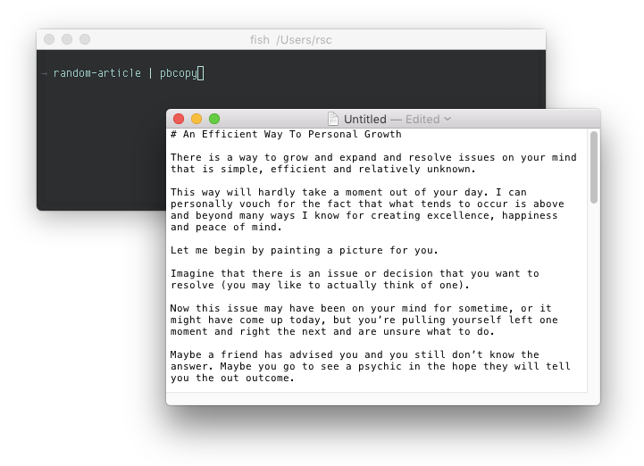

# random-article

> Fetches a random article for use as filler text

random-article fetches a random PLR (private label rights) article in Markdown format. Great for mockups.



## Usage

Requires Node.js v4 and above.

```sh
npm install -g @rstacruz/random-article
random-article
```

## Thanks

**random-article** © 2016+, Rico Sta. Cruz. Released under the [MIT] License.<br>
Authored and maintained by Rico Sta. Cruz with help from contributors ([list][contributors]).

> [ricostacruz.com](http://ricostacruz.com) &nbsp;&middot;&nbsp;
> GitHub [@rstacruz](https://github.com/rstacruz) &nbsp;&middot;&nbsp;
> Twitter [@rstacruz](https://twitter.com/rstacruz)

[MIT]: http://mit-license.org/
[contributors]: http://github.com/rstacruz/random-article/contributors
